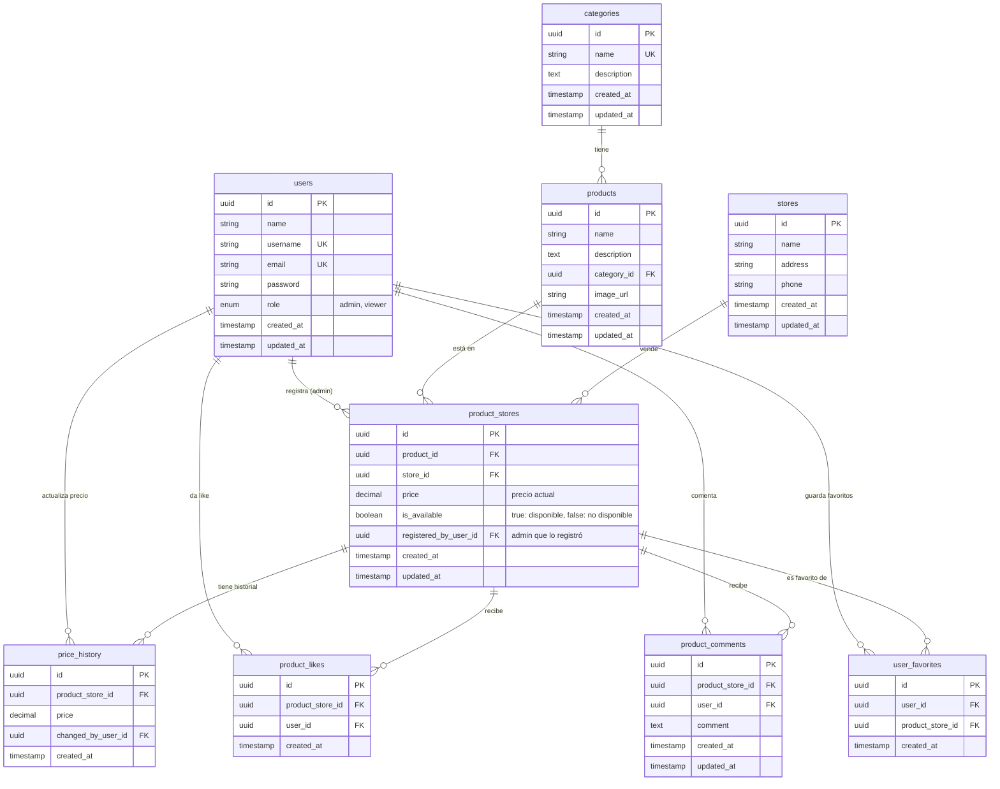

# Diagrama de Base de Datos - Cochaprecios

## Diagrama ER (Entity Relationship)



## Descripción de Tablas

### users
Almacena la información de los usuarios del sistema (administradores y visualizadores).
- **role**: `admin` puede registrar productos y tiendas, `viewer` solo puede visualizar, dar likes, comentar y guardar favoritos

### categories
Categorías de productos que pueden ser gestionadas por administradores.
- Inicialmente se poblarán con 4 categorías: Alimentos, Higiene personal, Limpieza, Electrónicos
- Los administradores pueden agregar nuevas categorías según sea necesario

### products
Información base de productos (sin precio ni tienda específica).
- Un producto puede estar en múltiples tiendas con diferentes precios

### stores
Tiendas/supermercados donde se venden productos.

### product_stores
**Tabla central**: Relaciona un producto con una tienda y su precio actual.
- Cada combinación producto-tienda es única
- Almacena el precio actual y disponibilidad
- Registra qué administrador lo creó

### price_history
Historial de cambios de precio de cada producto en cada tienda.
- Se crea un registro cada vez que un admin actualiza el precio
- Permite generar gráficos de evolución de precios

### product_likes
Validaciones/likes que los usuarios dan a un producto en una tienda específica.
- Un usuario solo puede dar un like por producto-tienda

### product_comments
Comentarios de usuarios sobre un producto en una tienda.
- Pueden ser validaciones de precio o comentarios generales

### user_favorites
Lista de productos favoritos de cada usuario.
- Permite a los usuarios hacer seguimiento de productos específicos

## Índices Recomendados

```sql
-- users
CREATE UNIQUE INDEX idx_users_username ON users(username);
CREATE UNIQUE INDEX idx_users_email ON users(email);
CREATE INDEX idx_users_role ON users(role);

-- products
CREATE INDEX idx_products_category ON products(category_id);
CREATE INDEX idx_products_name ON products(name);

-- product_stores
CREATE UNIQUE INDEX idx_product_stores_unique ON product_stores(product_id, store_id);
CREATE INDEX idx_product_stores_store ON product_stores(store_id);
CREATE INDEX idx_product_stores_available ON product_stores(is_available);

-- price_history
CREATE INDEX idx_price_history_product_store ON price_history(product_store_id);
CREATE INDEX idx_price_history_created ON price_history(created_at);

-- product_likes
CREATE UNIQUE INDEX idx_product_likes_unique ON product_likes(product_store_id, user_id);

-- product_comments
CREATE INDEX idx_product_comments_product_store ON product_comments(product_store_id);
CREATE INDEX idx_product_comments_user ON product_comments(user_id);

-- user_favorites
CREATE UNIQUE INDEX idx_user_favorites_unique ON user_favorites(user_id, product_store_id);
CREATE INDEX idx_user_favorites_user ON user_favorites(user_id);
```

## Reglas de Negocio

1. **Control de acceso por rol**:
   - Solo usuarios con rol `admin` pueden crear/modificar productos, tiendas y precios
   - Usuarios con rol `viewer` solo pueden consultar, dar likes, comentar y guardar favoritos

2. **Unicidad producto-tienda**:
   - Un producto solo puede tener un registro por tienda en `product_stores`
   - Si ya existe, se actualiza el precio y se crea registro en `price_history`

3. **Historial de precios**:
   - Cada cambio de precio genera automáticamente un registro en `price_history`
   - Esto permite generar gráficos de evolución temporal

4. **Likes únicos**:
   - Un usuario solo puede dar un like por producto-tienda
   - No se permite duplicar likes del mismo usuario

5. **Favoritos únicos**:
   - Un usuario no puede agregar el mismo producto-tienda más de una vez a favoritos

6. **Disponibilidad**:
   - Los administradores pueden marcar productos con `is_available = true/false`
   - Esto no elimina el producto, solo indica su estado actual

## Consultas Comunes

### Obtener productos de una tienda con precio actual
```sql
SELECT p.*, ps.price, ps.is_available, s.name as store_name
FROM products p
JOIN product_stores ps ON p.id = ps.product_id
JOIN stores s ON ps.store_id = s.id
WHERE s.id = ?
AND ps.is_available = true;
```

### Obtener historial de precios de un producto en una tienda
```sql
SELECT ph.price, ph.created_at, u.username
FROM price_history ph
JOIN product_stores ps ON ph.product_store_id = ps.id
JOIN users u ON ph.changed_by_user_id = u.id
WHERE ps.product_id = ? AND ps.store_id = ?
ORDER BY ph.created_at DESC;
```

### Obtener favoritos de un usuario
```sql
SELECT p.*, ps.price, s.name as store_name
FROM user_favorites uf
JOIN product_stores ps ON uf.product_store_id = ps.id
JOIN products p ON ps.product_id = p.id
JOIN stores s ON ps.store_id = s.id
WHERE uf.user_id = ?;
```

### Comparar precios de un producto en diferentes tiendas
```sql
SELECT s.name as store_name, ps.price, ps.is_available
FROM product_stores ps
JOIN stores s ON ps.store_id = s.id
WHERE ps.product_id = ?
ORDER BY ps.price ASC;
```
